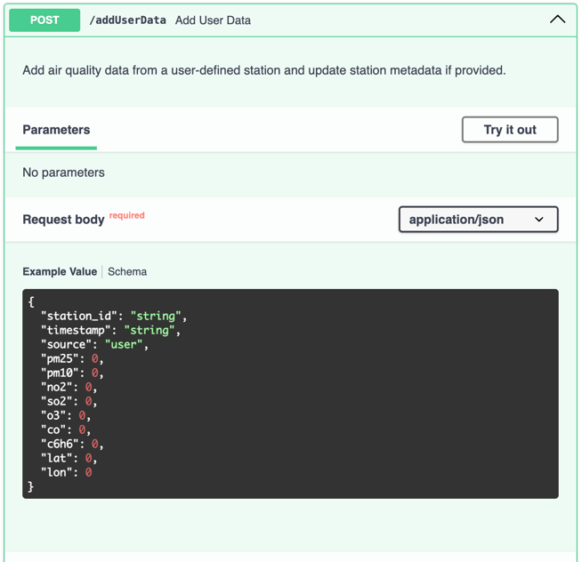

# System monitorowania jakości powietrza z wykorzystaniem przetwarzania i analizy dużych zbiorów danych

## 1. Cel i zakres opracowania

### Cel
Celem projektu było zaprojektowanie i wdrożenie zaawansowanego systemu monitorowania jakości powietrza, który integruje, przetwarza i analizuje duże zbiory danych (Big Data) pochodzące z publicznych źródeł (GIOŚ – Główny Inspektorat Ochrony Środowiska) oraz od użytkowników indywidualnych. System miał zapewnić:

- gromadzenie danych w czasie rzeczywistym z API GIOŚ,
- gromadzenie danych użytkownika z geolokalizacją,
- przechowywanie danych w bazie InfluxDB, zoptymalizowanej dla szeregów czasowych o dużej skali,
- przetwarzanie i agregację danych w różnych horyzontach czasowych (godzinowych, dziennych, tygodniowych, miesięcznych),
- udostępnianie wyników w formie interaktywnego interfejsu graficznego oraz API RESTful.

Projekt koncentrował się na efektywnym zarządzaniu trzema kluczowymi cechami Big Data: wolumenem (duża ilość danych pomiarowych), szybkością (real-time data ingestion) oraz różnorodnością (dane z GIOŚ i użytkownika).

### Zakres
Zakres opracowania obejmował pełny cykl życia danych w systemie Big Data:

- **źródła danych** - pobieranie danych z API GIOŚ oraz przyjmowanie danych użytkownika poprzez endpoint `/addUserData`,
- **backend** - aplikacja FastAPI do obsługi API, zapisu i wyszukiwania danych,
- **baza danych** - InfluxDB z pomiarami `air_quality` (dane pomiarowe) i `user_stations` (metadane stacji),
- **frontend** - interfejs Streamlit z mapą stacji i wykresami zanieczyszczeń,
- **przetwarzanie** - mechanizmy filtrowania, agregacji i geolokalizacji danych.

## 2. Charakterystyka struktury funkcjonalno-informacyjnej opracowania

System jest modularny, oparty na architekturze klient-serwer z wyraźnym podziałem na **backend (FastAPI), frontend (Streamlit) i bazę danych (InfluxDB)**. Poniżej szczegółowo opisano funkcje i aspekty informacyjne, z przykładami kodu i propozycjami wizualizacji.
### 2.1. Gromadzenie danych

#### Źródła danych:
- **GIOŚ** - dane pobierane cyklicznie z API GIOŚ za pomocą gios_api.py, obejmujące pomiary zanieczyszczeń (PM2.5, PM10, NO2, SO2, O3, CO, C6H6) dla setek stacji w Polsce; funkcja `fetch_and_save()` w `backend/gios_api.py` odpowiada za ich zapis do InfluxDB.
- **Dane użytkownika** - przyjmowane przez endpoint `/addUserData `w formacie JSON, z polami takimi jak `station_id`, `timestamp`, wartości pomiarowe oraz `lat` i `lon` dla geolokalizacji.

#### Mechanizm zapisu
- Synchroniczny zapis do InfluxDB z użyciem `write_api`, zapewniający niezawodność i prostotę implementacji.
Przykład kodu w `database.py`:
    ```python
    def save_user_station(station_data: Dict[str, Any]) -> None:
        lat_value = float(station_data.get("lat", 0))
        lon_value = float(station_data.get("lon", 0))
        point = Point("user_stations")
                  .tag("station_id", station_data["station_id"])
                  .field("lat", lat_value)
                  .field("lon", lon_value)
                  .time(datetime.utcnow().isoformat()
                )
        logging.info(f"Preparing to save user station: {point.to_line_protocol()}")
        write_api.write(bucket=INFLUXDB_BUCKET, org=INFLUXDB_ORG, record=[point])
    ```
- **Struktura informacyjna** - dane są zapisywane jako szeregi czasowe z tagami (`station_id`, `source`) i polami (`lat`, `lon`, wartości pomiarowe), co umożliwia ich szybkie indeksowanie i wyszukiwanie.

#### Charakterystyka
System realizuje gromadzenie danych poprzez automatyczne pobieranie z API GIOŚ w cyklach godzinowych oraz elastyczne przyjmowanie danych użytkownika w czasie rzeczywistym, co zapewnia ciągły napływ informacji z różnych źródeł.

#### Aspekty informacyjne
Dane są wzbogacone o kontekst przestrzenny (współrzędne) i czasowy.


### 2.2. Przetwarzanie danych

#### Integracja źródeł
Dane GIOŚ i użytkownika są scalane w bazie InfluxDB z tagiem `source` (`gios` lub `user`), co umożliwia jednolite przetwarzanie.

```python
class UserAirQualityData(AirQualityData):
    station_id: str = Field(..., description="User-defined station ID")
    source: str = Field("user", description="Source fixed to 'user' for user-submitted data")
    lat: Optional[float] = Field(None, description="Latitude of the user station")
    lon: Optional[float] = Field(None, description="Longitude of the user station")
```

#### Agregacja
Zapytania Flux w `get_air_quality` obsługują dynamiczną agregację.

```flux
from(bucket: "{INFLUXDB_BUCKET}")
|> range(start: {start}T00:00:00Z, stop: {end}T23:59:59Z)
|> filter(fn: (r) => r._measurement == "air_quality")
|> filter(fn: (r) => r["station_id"] == "iot_station_1")
|> aggregateWindow(every: 1h, fn: mean, createEmpty: false)
|> pivot(rowKey: ["_time"], columnKey: ["_field"], valueColumn: "_value")
```

### 2.3. Wyszukiwanie

Zapytania Flux do pobierania metadanych stacji.

```flux
from(bucket: "{INFLUXDB_BUCKET}")
|> range(start: -10y)
|> filter(fn: (r) => r._measurement == "user_stations")
|> group(columns: ["station_id", "_time"])
|> pivot(rowKey: ["_time"], columnKey: ["_field"], valueColumn: "_value")
|> filter(fn: (r) => exists r.lat and exists r.lon)
|> group(columns: ["station_id"])
|> sort(columns: ["_time"], desc: true)
|> limit(n: 1)
|> keep(columns: ["station_id", "lat", "lon"])
```

### 2.4. Udostępnianie danych

Mapa stacji w Streamlit.

```python
def display_map(station_df):
    fig_map = px.scatter_mapbox(
        station_df,
        lat="lat",
        lon="lon",
        hover_name="name",
        size="size",
        color_discrete_sequence=[[backend](backend)"red"],
        zoom=4.5,
        height=500,
        title="Station Locations"
    )
    fig_map.update_layout(mapbox_style="open-street-map")
    st.plotly_chart(fig_map)
```

## 3. Podsumowanie i wnioski

### Podsumowanie
System monitorowania jakości powietrza jest w pełni funkcjonalnym rozwiązaniem Big Data, integrującym dane z GIOŚ i użytkownika w InfluxDB.

### Wnioski

- **InfluxDB w Big Data**: baza szeregów czasowych umożliwia efektywne zarządzanie dużymi wolumenami danych temporalnych,
- **Flux i geolokalizacja**: precyzyjne grupowanie i filtrowanie w zapytaniach Flux pozwala na poprawną integrację danych przestrzennych,
- **Streamlit**: prosty, ale potężny framework do wizualizacji danych,
- **FastAPI**: wydajne API RESTful, które może być łatwo udokumentowane i zintegrowane z innymi systemami.

## 4. Literatura – wykorzystane źródła

- [InfluxDB Documentation](https://docs.influxdata.com/influxdb/v2/)
- [FastAPI Documentation](https://fastapi.tiangolo.com/)
- [Streamlit Documentation](https://docs.streamlit.io/)
- [API GIOŚ](https://powietrze.gios.gov.pl/pjp/content/api)
- [Plotly Documentation](https://plotly.com/python/)

## 5. Podsumowanie w kontekście Big Data

- **volume**: obsługa tysięcy rekordów z GIOŚ i użytkownika,
- **velocity**: szybki zapis i odczyt dzięki InfluxDB,
- **variety**: integracja danych strukturalnych (GIOŚ) i niestrukturalnych (użytkownik),
- **veracity**: precyzyjne przetwarzanie geolokalizacji i agregacji,
- **value**: dostarcza actionable insights poprzez wizualizacje i API.


## 6. Instalacja

#### Pobranie obrazu i zainstalowanie bazy danych w Dockerze
```bath
docker run -d -p 8086:8086 --name influxdb influxdb:latest
```
#### Konfiguracja
```
http://localhost:8086/onboarding/0
username: admin
password: InfluxDB
initial organization: AHE
initial bucket: DZB
```
#### Ustawienia środowiskowe (```.env```)
```
INFLUXDB_URL=http://localhost:8086
INFLUXDB_TOKEN=token
INFLUXDB_ORG=AHE
INFLUXDB_BUCKET=DZB
```

#### Struktura projektu
##### Podział backendu (FastAPI)
- ```main.py``` – główny plik FastAPI, importujący funkcje z innych modułów.
- ```database.py``` – konfiguracja InfluxDB (połączenie, zapis, odczyt).
- ```gios_api.py``` – funkcje pobierania danych z API GIOŚ.
- ```models.py``` – definicje modeli Pydantic dla walidacji danych.
- ```scheduler.py``` – obsługa harmonogramu pobierania danych (z schedule).
- ```utils.py``` – dodatkowe funkcje pomocnicze.

##### Podział frontendu (Streamlit)
- ```app.py``` – główny plik uruchamiający aplikację Streamlit.
- ```data_fetch.py``` – pobieranie danych z FastAPI.
- ```gios_api.py``` – funkcje pobierania danych z API GIOŚ.
- ```ui_elements.py``` – komponenty UI, np. mapa, wykresy, filtry.
- ```utils.py``` – funkcje pomocnicze (np. formatowanie danych).

##### Instalacja zależności
```bash
  pip install -r frontend/requirements.txt
```
```bash
  pip install -r backend/requirements.txt
```

#### Uruchomienie
```bash
  uvicorn backend.main:app --reload --port 8000
```
```bash
  streamlit run frontend/app.py
```
